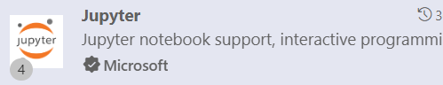

# MLOps and AI Security Course

## Using this Repository
This repository contains the course materials for the MLOps and AI Security course. The course is divided into modules, each of which contains a Jupyter Notebook with the course content. The notebooks are designed to be interactive, so you can run the code and experiment with the examples.

This course is for students that enrolled in the ML Ops and AI Security course presented by *Chuck McCullough*

## Recommended Software
- [Anaconda](https://www.anaconda.com/products/individual) - Anaconda is a distribution of Python that comes with all the necessary libraries and software for data science. It is the recommended way to install Python for this course.
- Alternative to Anaconda: [Python](https://www.python.org/downloads/) - Python is the programming language we will be using for this course. You can download Python from the official website.
- [Visual Studio Code](https://code.visualstudio.com/) - Visual Studio Code is a lightweight code editor that is great for writing Python code. It has built-in support for Jupyter Notebooks and Python debugging.
  - Jupyter extension for VS Code. 